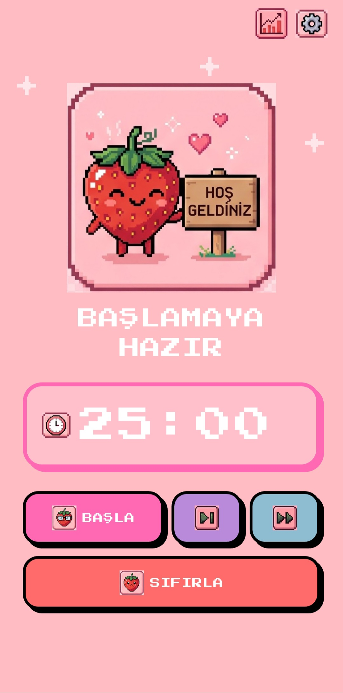
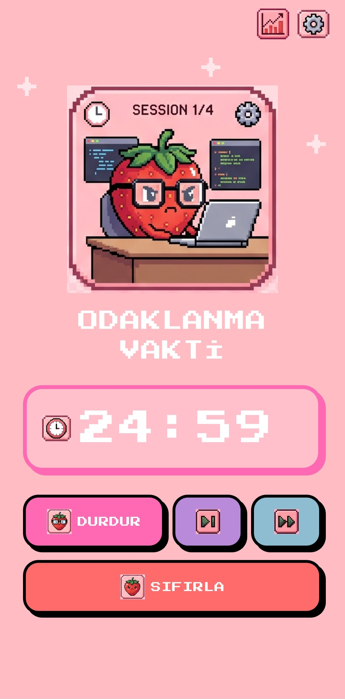
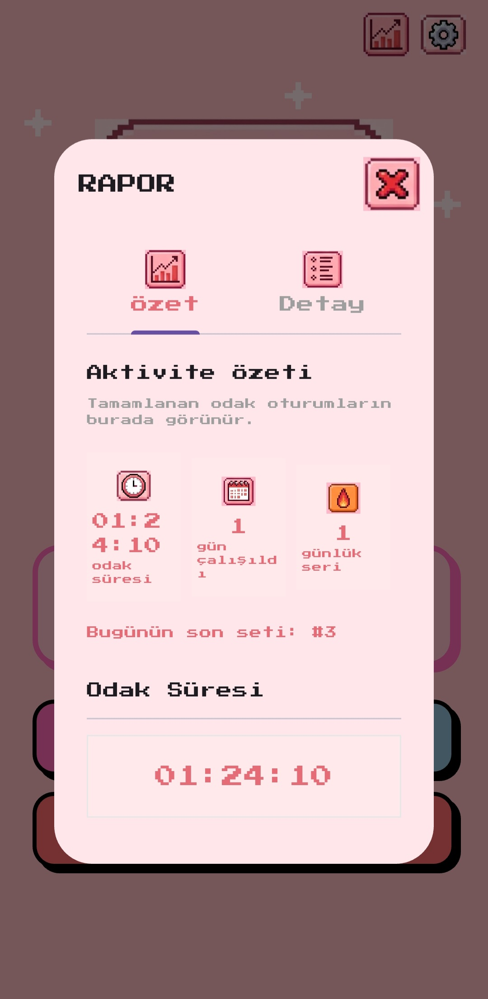
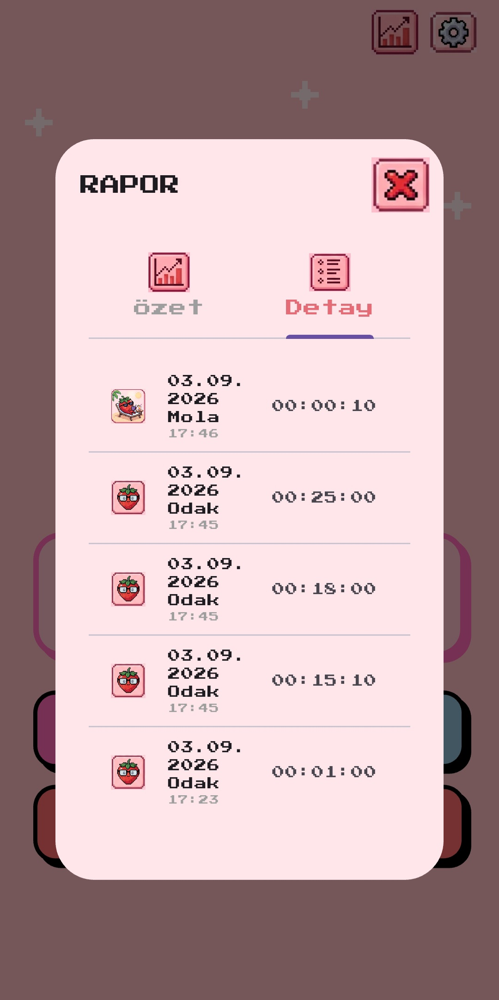
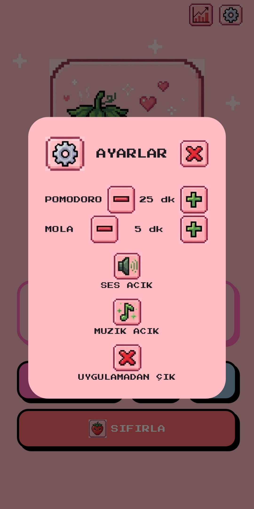
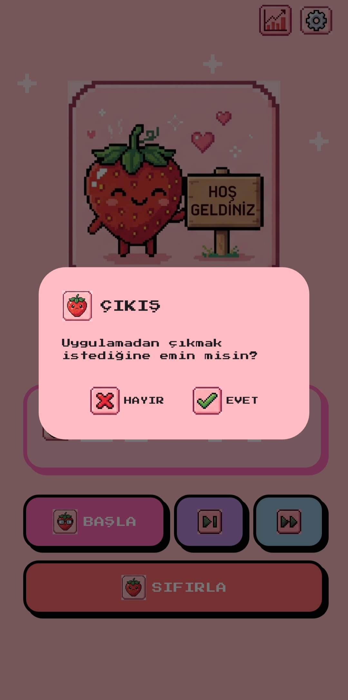

# Pomodoro App

Pixel art estetiğiyle tasarlanmış, cihaz üzerinde çalışan bir Pomodoro takip uygulaması. Uygulama odaklanma ve mola fazlarını yönetir, tamamlanan oturumları yerel depolamada saklar ve rapor ekranında geçmiş çalışma verilerini gösterir.

## Özellikler

- 25 dakikalık odaklanma ve 5 dakikalık mola varsayılanları
- Ayarlardan odaklanma ve mola sürelerini değiştirme
- Bir pomodoro ile onu takip eden molayı tek bir set olarak takip etme
- Tamamlanan setleri gün içinde `#1`, `#2`, `#3` biçiminde gösterme
- Odak ve mola sürelerini ayrı ayrı raporlama
- Çalışma devam ederken geçen gerçek süreyi saniye hassasiyetinde saklama
- Uygulama kapatılıp yeniden açıldığında aktif süreyi koruma
- Odak ve mola fazlarını atlama
- Aktif fazı 60 saniye ileri sarma
- Uygulama, rapor ve ayarlar için pixel art ikonları
- Döngüsel arka plan müziği ve uyarı seslerini açıp kapatma

## Ekran Görüntüleri

Ekran görüntüleri [assets/screenshots](assets/screenshots/) klasöründe tutulur.

### Ana Ekran



Ana ekranda üst sağda rapor ve ayarlar ikonları, ortada mevcut fazı temsil eden hero görseli ve sayaç bulunur. Alt bölümde başlatma, atlama, ileri sarma ve sıfırlama kontrolleri yer alır.

### Odaklanma



Pomodoro başladığında uygulama çalışma fazına geçer ve odaklanma görselini gösterir. Bu fazda arka plan müziği durur.

### Mola


Odaklanma süresi tamamlandığında mola fazı başlar. Mola son 30 saniyeye girdiğinde uyarı sesi ve görsel bildirim devreye girer.

### Mola Bitiyor Uyarısı


Mola bitimine 30 saniye kaldığında uyarı sesi döngüye alınır. Ses ayarlardan kapatılabilir.

### Rapor



Rapor ekranı iki sekmeden oluşur:

- **Özet:** Odak süresi, mola süresi, çalışılan gün, günlük seri ve o gün tamamlanan son set numarası
- **Detay:** Her oturumun tarihi, saati, türü ve `saat:dakika:saniye` biçimindeki süresi

### Detay Sekmesi



Detay satırlarında odak oturumları `pomodoro-start.jpg`, mola oturumları `mola.jpg` ikonu ve küçük tür etiketiyle ayırt edilir.

### Ayarlar



Ayarlar ekranından pomodoro ve mola süreleri artırılıp azaltılabilir. Ses efektleri, arka plan müziği ve uygulamadan çıkış seçenekleri de bu bölümde bulunur.

### Uygulamadan Çıkış



Çıkış seçildiğinde işlem, `pomodoro-end.jpg` ikonu bulunan onay penceresiyle doğrulanır.

### Uygulama İkonu


## Çalışma Mantığı

Uygulamanın timer akışı üç durumla yönetilir:

1. **Boşta:** Uygulama açılış görseli görünür ve sayaç yeni bir pomodoro için hazırdır.
2. **Odaklanma:** Kullanıcı başlattığında çalışma süresi azalır. Her geçen saniye aktif odak süresine eklenir.
3. **Mola:** Odaklanma tamamlandığında mola başlar. Mola da aynı sayaç mantığıyla ilerler.

Bir pomodoro tamamlandığında odak oturumu kaydedilir. Mola da tamamlandığında bu iki faz birlikte bir set olarak kabul edilir ve set sayısı bir artırılır. Böylece yarım kalan bir çalışma set olarak sayılmaz, ancak çalışılan gün bilgisi pomodoro başlatıldığı anda kaydedilir.

`ATLA` çalışma fazını mola fazına, mola fazını boşta durumuna taşır. `İLERİ SAR` aktif fazdan 60 saniye azaltır; son 60 saniye içindeyse fazı tamamlar. `SIFIRLA` aktif sayaç ve devam eden süre kaydını temizleyerek yeni bir pomodoro başlatmaya hazırlar.

## Yerel Veri Saklama

Veriler `shared_preferences` paketiyle cihazın yerel depolamasında tutulur. Sunucu, hesap veya internet bağlantısı gerekmez.

Kullanılan anahtarlar:

- `focus_sessions`: Tamamlanan odak ve mola oturumlarının JSON kayıtları
- `activity_dates`: Pomodoro başlatılan günler
- `completed_sets`: Tamamlanan pomodoro+mola setlerinin tarihleri
- `active_work_seconds`: Tamamlanmamış aktif odak süresi
- `active_break_seconds`: Tamamlanmamış aktif mola süresi

Oturum kayıtları `durationSeconds` alanını kullanır. Bu sayede `25:00` gibi sabit ayar değerleri yerine gerçek çalışma süresi, örneğin `00:32:38`, rapora yansır. Uygulama tekrar açıldığında aktif süre okunur ve raporda korunur. Eski dakika tabanlı kayıtlar da geriye dönük uyumluluk için okunabilir.

## Ses Davranışı

- Arka plan müziği `sounds/loop.mp3` dosyasından gelir ve loop modunda çalışır.
- Pomodoro veya mola başladığında arka plan müziği durur.
- Faz tamamlanıp uygulama boşta kaldığında müzik yeniden başlar.
- Müzik kapatma ayarı açık olmadığı sürece bu davranış devam eder.
- Buton tıklamaları `button-click.mp3` ile, mola uyarısı `alert-warn.mp3` ile yönetilir.

## Proje Yapısı

```text
lib/main.dart                         Uygulama, timer ve rapor ekranı
test/widget_test.dart                 Widget ve rapor akış testleri
assets/asset-sheet_slices/            Uygulama içi pixel art ikonları
assets/sounds/                        Müzik ve ses efektleri
assets/screenshots/                   README'de kullanılan ekran görüntüleri
android/, ios/, macos/, linux/        Flutter platform hedefleri
web/, windows/                        Web ve Windows platform hedefleri
```

## Kurulum ve Çalıştırma

Flutter SDK ve Dart SDK kurulu olmalıdır.

```bash
flutter pub get
flutter run
```

Belirli bir cihaz seçmek için:

```bash
flutter devices
flutter run -d <device-id>
```

Testleri çalıştırmak için:

```bash
flutter test
```

Statik analiz için:

```bash
flutter analyze
```

## Kullanılan Paketler

- `google_fonts`: Pixel temalı yazı tipi
- `audioplayers`: Arka plan müziği, tıklama ve uyarı sesleri
- `shared_preferences`: Cihaz üzerinde kalıcı yerel veri saklama

## Tasarım Yaklaşımı

Arayüz, klasik Pomodoro uygulamalarındaki yoğun bilgi panelleri yerine pixel art görselleri ve büyük dokunma alanları üzerine kuruludur. Hero görseli uygulamanın mevcut durumunu doğrudan anlatır. Rapor ve ayarlar üst sağda yalnız ikon olarak konumlandırılmıştır. Rapor kartı uygulamanın pembe paletini korur; süreler ve istatistikler aynı görsel dil içinde, kolay taranabilir bölümlere ayrılır.
